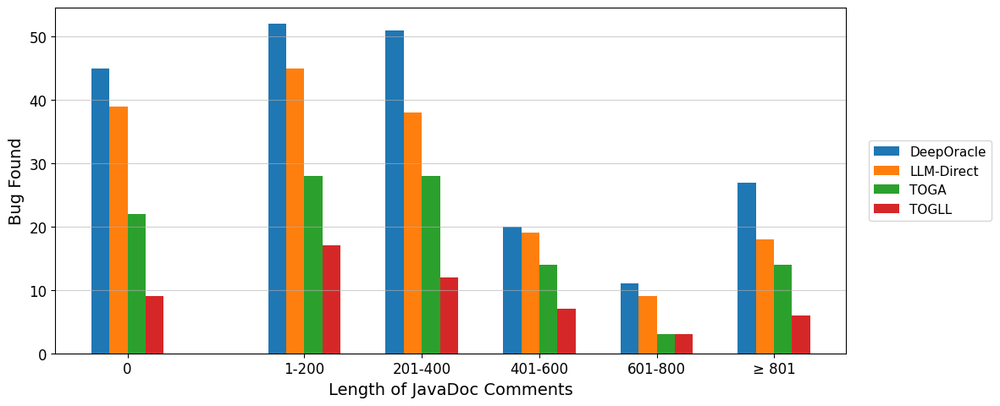
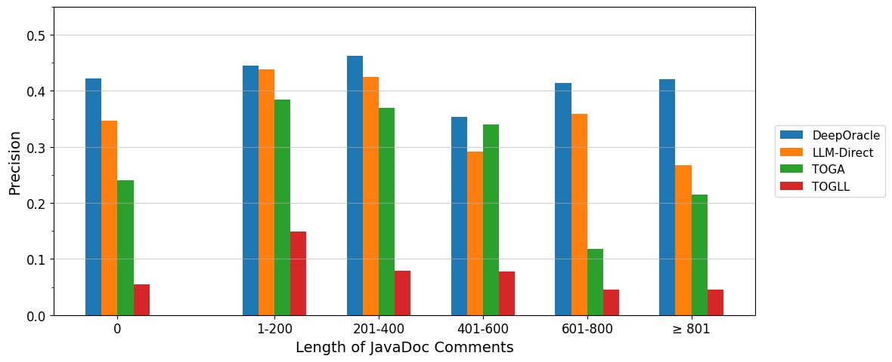

# Supplementary Material

This page provides additional figures and results for the paper under anonymous review.

---

## Additional Figures

### Figure A1: Number of bugs found in different javadoc length ranges

### Figure A2: Precision of methods under different javadoc length intervals

---

*This page will be updated with the official repository upon acceptance.*
